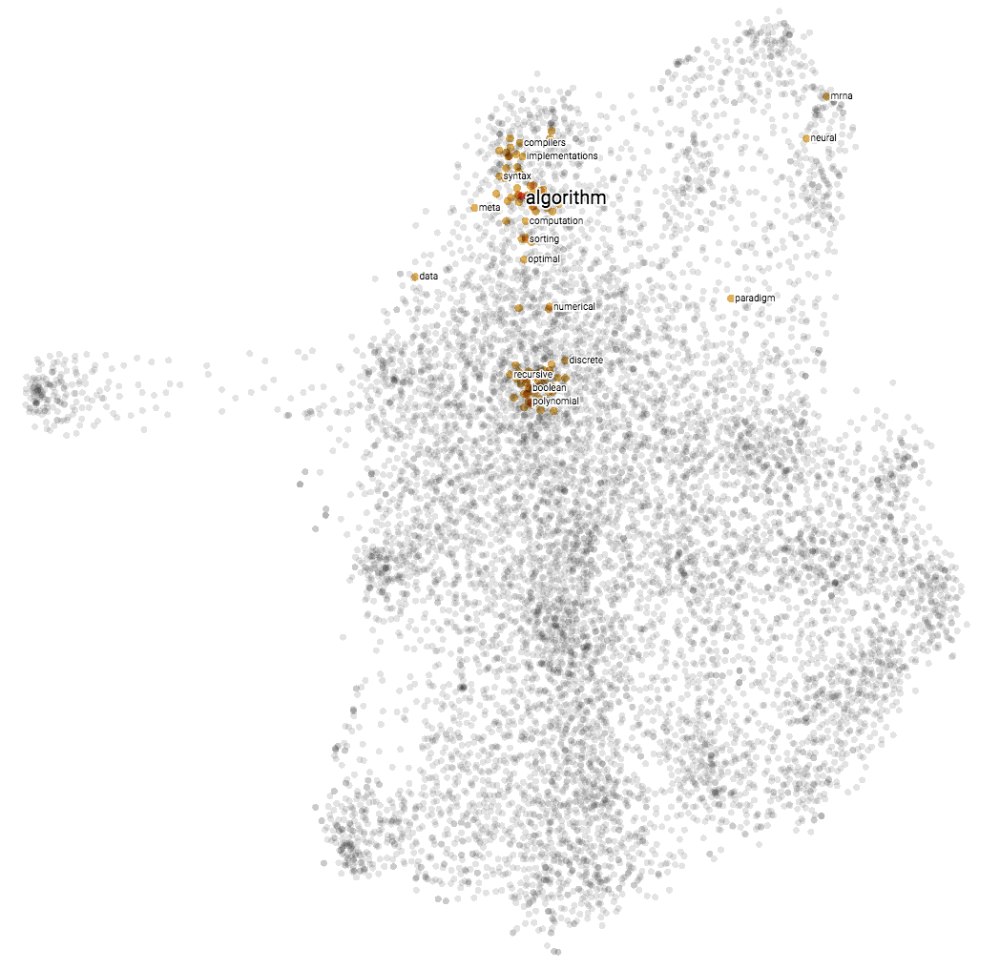

# Word Embeddings for Restricted Access Corpora

This repository contains all the code necessary to reproduce the results in the blog post "Word Embeddings for Restricted Access Corpora" by Fabian Offert, published on the [WE1S research blog](http://we1s.ucsb.edu/research_post/word-embeddings-for-restricted-access-corpora/).

## Abstract

Given the problem of a restricted access corpus where full texts cannot be stored locally, we propose to make use of the fact that the skip gram algorithm operates on bigrams to train a word embedding model on as little as a word-context-frequency matrix in a highly memory-efficient way.

## Installation

This repository officially only supports Unix-based operating systems but most likely runs on Windows as well, given a proper Python environment (untested).

### Manual installation using pip or conda

We suggest running the notebooks within an [Anaconda](https://www.anaconda.com/download) or [Miniconda](https://conda.io/miniconda.html) envrionment. The notebook in the repository has only Python dependencies, all of which can be installed with `pip` or `conda`. To install all dependencies with conda in a Miniconda environment, run

`conda install gevent Pillow`

`pip install tensorflow-gpu keras tqdm`

`conda install -c conda-forge spacy`.

Replace `tensorflow-gpu` with `tensorflow` for a CPU only installation. 

Finally, clone this repository and run a `jupyter notebook` server in the repository directory.

### Installation using [Docker](https://www.docker.com/)

Clone this repository. Open [`run_CPU.sh`](docker/run_CPU.sh) or [`run_GPU.sh`](docker/run_GPU.sh) in a plain text editor of your choice and replace `YOUR PASSWORD HERE` with a password of your choice. Run either `run_GPU.sh` or `run_CPU.sh` for an environment with or without NVIDIA GPU support. NVIDIA support with Docker currently only works under Linux.

## Embedding projector

The notebook interfaces with TensorBoard for the visualization of the produced word embeddings. To start it, run `tensorboard --logdir=projector --port=6006` from within the repository directory.

*Word embeddings trained with our method in TensorFlow’s embedding projector.*