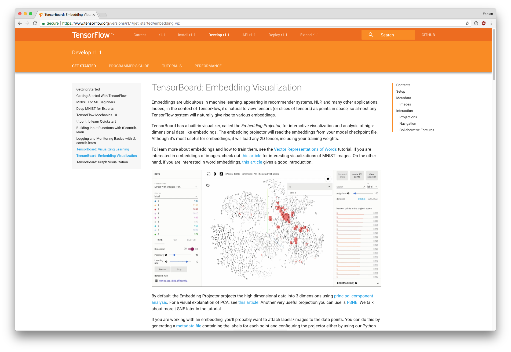
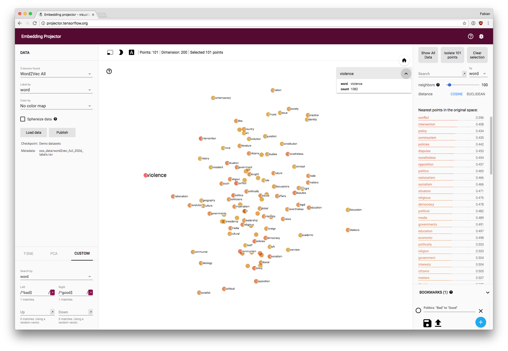
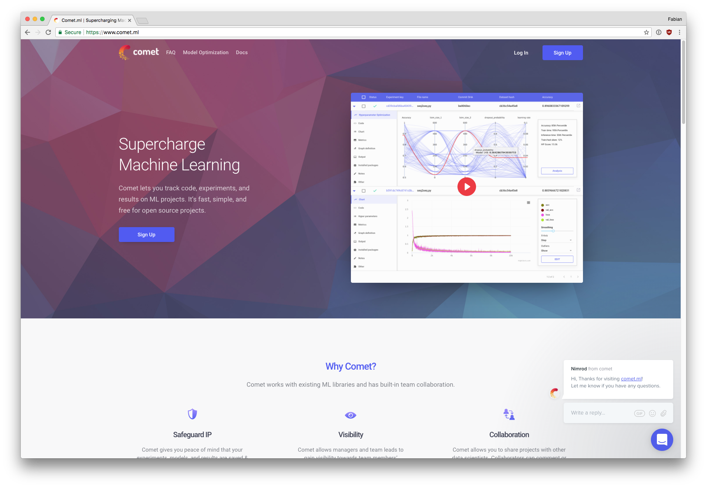
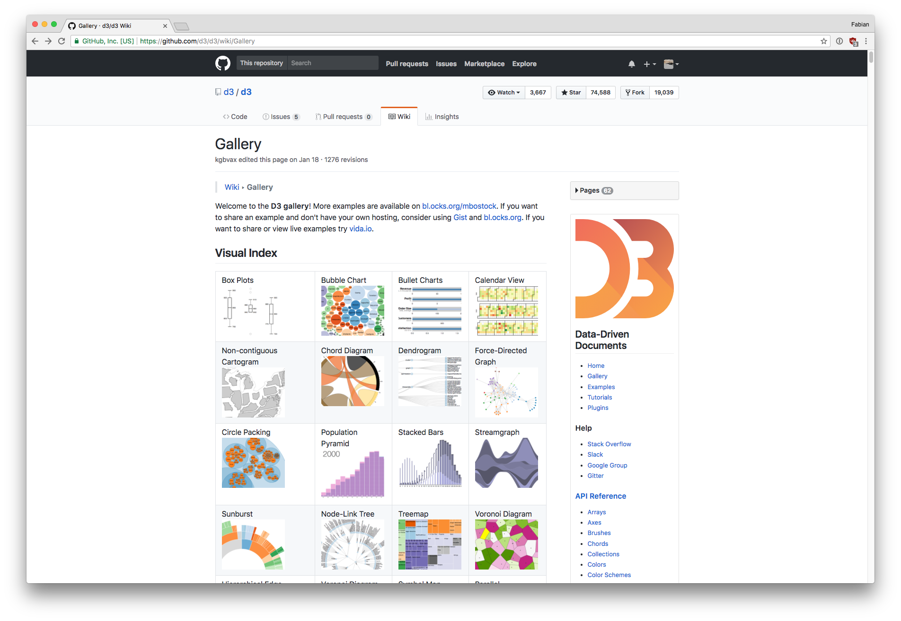
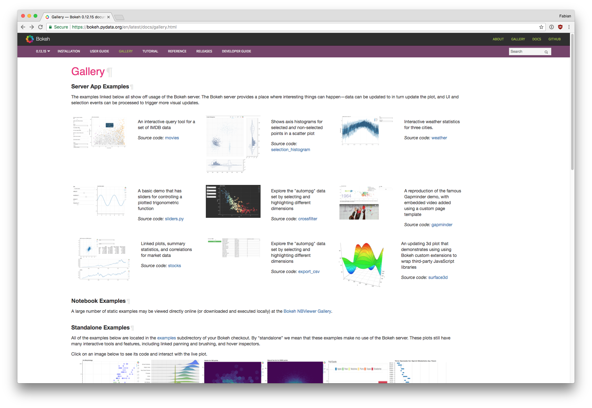
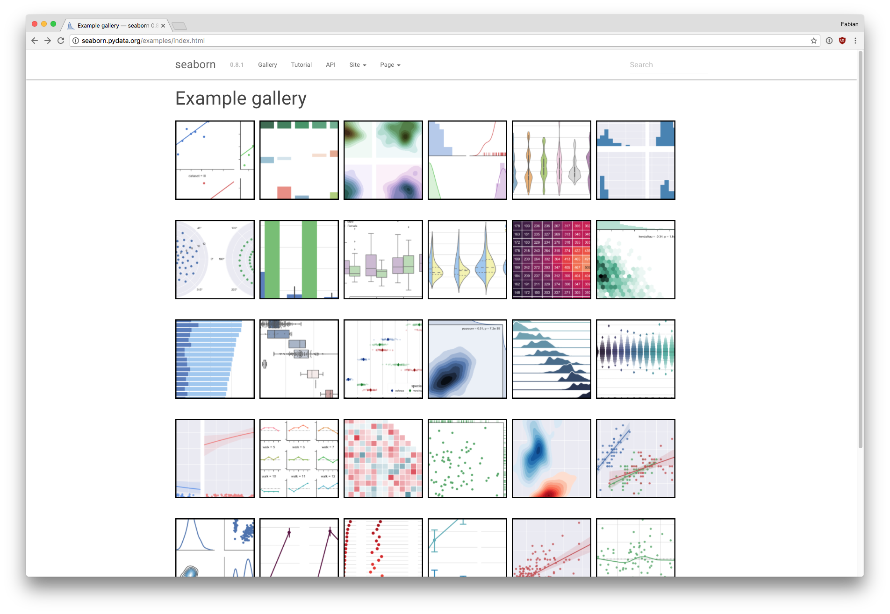
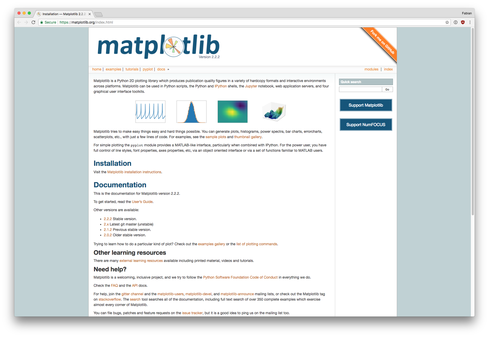
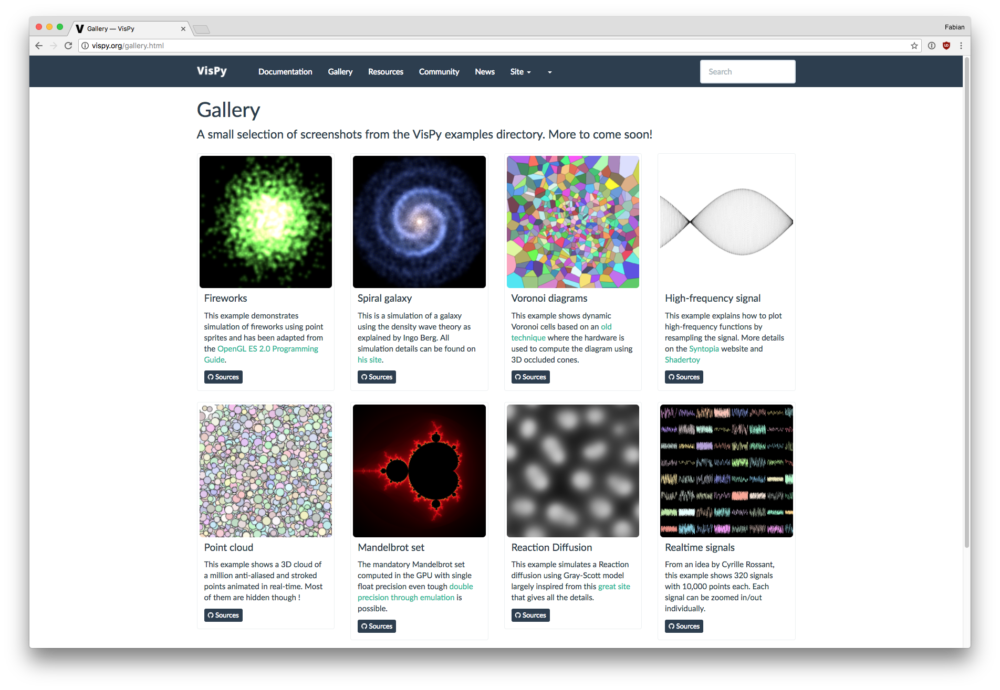
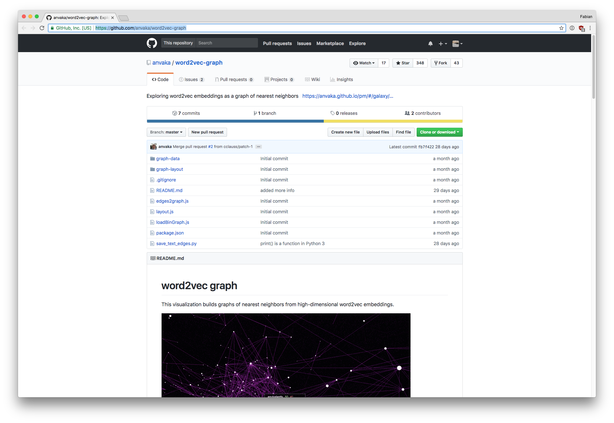
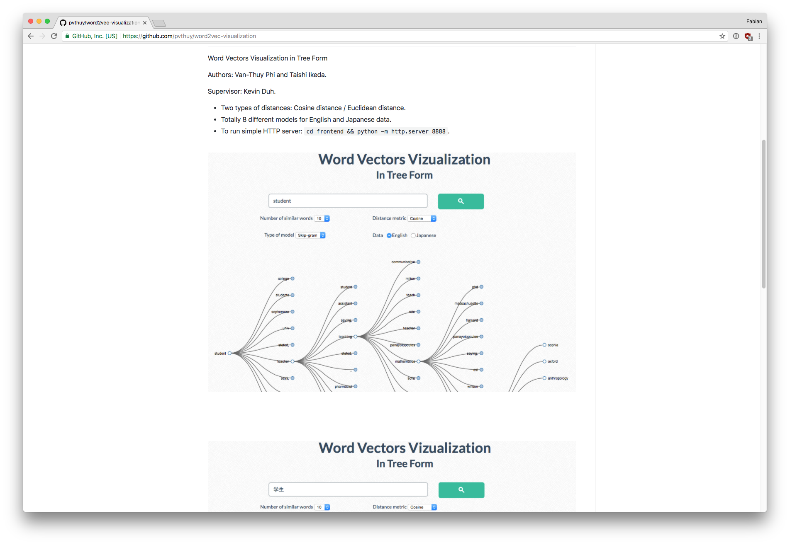

# Visualization of Word Embeddings

## Introduction

Geoff Hinton, teaching people to imagine 13-dimensional space, suggests that students first picture 3-dimensional space and then say to themselves: "Thirteen, thirteen, thirteen." Given the high-dimensional nature of word-embeddings, visualization is a necessary prerequisite to the intuitive exploration of the embedding space.

## Software

### General-purpose ML visualization frameworks

#### Tensor Board

#### Comet ML

### General-purpose dimensionality reduction techniques

#### T-SNE

### General-purpose data visualization libraries

#### D3

#### Bokeh

#### Seaborn

#### Matplotlib

#### VisPy

### Single-project visualizations

#### anvaka/word2vec-graph

#### pvthuy/word2vec-visualization

